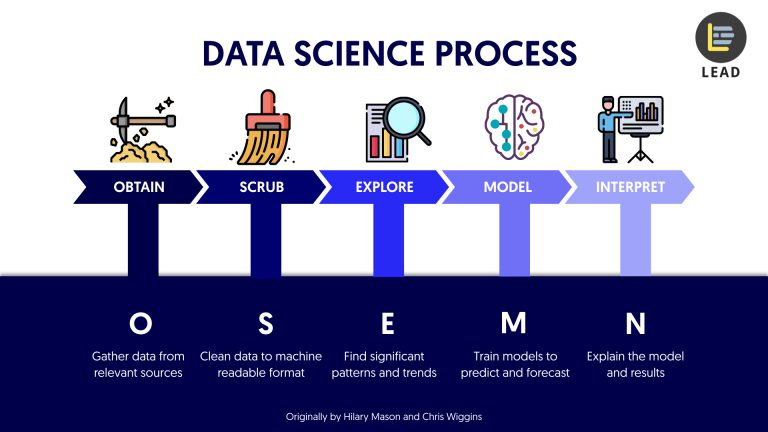

---

## [OSEMN Framework](https://github.com/berkmonder/dataScience-portfolio/tree/main/OSEMN), *Data Science Process*

- **[Obtaining Data](https://github.com/berkmonder/dataScience-portfolio/tree/main/OSEMN/1-Obtain/):**
	- **Python** (`Request`, `BeautifulSoup`, `Selenium`, `MongoDB`)
- **[Scrubbing Data](https://github.com/berkmonder/dataScience-portfolio/tree/main/OSEMN/2-Scrub/)**: *work in progress...*
- **[Exploring Data](https://github.com/berkmonder/dataScience-portfolio/tree/main/OSEMN/3-Explore/)**: *work in progress...*
- **[Modelling Data](https://github.com/berkmonder/dataScience-portfolio/tree/main/OSEMN/4-Model/)**: *work in progress...*
- **[iNterpreting Data](https://github.com/berkmonder/dataScience-portfolio/tree/main/OSEMN/5-iNterpret/)**: *work in progress...*

**Keywords:** **`Python`**
